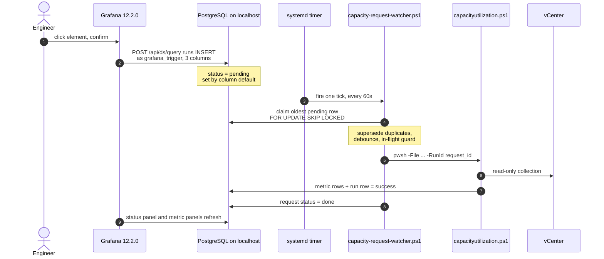

# Optional Feature: On-demand capacity refresh button

Optional add-on to the collector documented in [README.md](README.md). Skip this file
entirely if you only run the daily collection. Deployment paths referenced below
(`<deployment_path>`) are listed in [README section 12](README.md#12-deployment-paths-per-site).

## 1. What it does

Engineers about to rebalance VMs by hand (vMotion) need a fresh snapshot without SSHing to
the collector host. The dashboard gets a **Run capacity collection now** button:

1. The button inserts a `pending` row into `capacity_run_requests` through a second,
   write-scoped Grafana datasource.
2. `scripts/capacity-request-watcher.ps1`, fired by a systemd timer every ~60s on the
   collector host, claims the row and runs the existing `capacityutilization.ps1` with
   `-RunId <request_id>`.
3. The **Latest Manual Refresh Request** panel shows `pending -> claimed -> done`, after
   which the existing panels show the fresh snapshot.

The button triggers a **read-only collection only**. No vMotion, no rebalancing, no
privileged vCenter change - those stay manual human steps.

### 1.1 How it works, in one paragraph

Use this when someone asks how it was built:

> A canvas element in Grafana runs an action that POSTs an `INSERT` to Grafana's own query
> API, through a second datasource whose database role can only insert three columns into one
> small request table - it can't read anything or touch the metric tables. A systemd timer on
> the collector host wakes a PowerShell script every 60 seconds; it claims the oldest pending
> request, collapses duplicates, declines if a run just happened or is still going, then runs
> the existing collector unchanged with the request's id as its run id. When the collector
> finishes, the watcher reads the outcome from the runs table and marks the request done or
> failed, and the dashboard shows that transition. No new network port, no API service, and
> the collector host only ever makes outbound connections to its local database.

### 1.2 End to end



Two trust boundaries are worth pointing at on that diagram: step 2 is the only thing the
dashboard can do to the database, and it is capped by the `grafana_trigger` grant; everything
from step 4 onwards is the collector host talking outbound to its own local Postgres, with
nothing listening.

### 1.3 What not to claim about it

- **Not restricted to specific people beyond dashboard permissions.** Anyone with Edit rights
  on the dashboard can trigger a collection - that is the intended access control, enforced by
  Grafana, not by the DB role.
- **Not real time.** Worst case is ~60s of polling latency plus the collection itself.
- **CORS is not one of the security controls.** On the correct origin the request is
  same-origin and CORS never applies; a CORS error means Grafana is being browsed on the wrong
  hostname (see section 6).

## 2. New DB objects, roles and grants

`db/add_manual_trigger.sql` (additive, idempotent, re-runnable, touches nothing created by
`db/init_timescale.sql`):

- `capacity_run_requests` - a plain table, **deliberately not a hypertable**: a control
  table of a few rows, not time-series. `request_id uuid PRIMARY KEY DEFAULT
  gen_random_uuid()` (core in PG13+; on PG12 or older run
  `CREATE EXTENSION IF NOT EXISTS pgcrypto;` first).
- `ix_run_requests_pending` - partial index on the pending queue.
- Role `grafana_trigger` - `CONNECT`, `USAGE ON SCHEMA public`, and
  `INSERT (requested_by, vcenter_name, note)` on that one table. **Nothing else**: no
  `SELECT`, `UPDATE`, `DELETE`, no other table, no sequence. `request_id`, `status` and the
  timestamps come from column defaults, which need no privilege.
- `GRANT SELECT, UPDATE ON capacity_run_requests TO vmware_collector` - the watcher claims
  and completes rows. The existing Grafana read datasource also connects as
  `vmware_collector`, so the status panel is covered by the same `SELECT`; no new read role.

Not created here: the `grafana_trigger` password. Generate it per site, store it at
`<deployment_path>/secrets/grafana_trigger_pw.txt` (`chmod 600`), and enter the same value
into that site's write-scoped Grafana datasource (Grafana encrypts it at rest).

## 3. Apply the migration (one-time, change-managed)

Run through the existing one-time DB-apply path - **not** from the daily job.

First, the button role password. This is the same on either route:

```bash
DEPLOY_PATH=/opt/vmware-capacity           # Site A: /var/www/vmware-capacity
SECRETS_DIR="$DEPLOY_PATH/secrets"         # wherever PGPasswordFile in your .psd1 points

umask 077
openssl rand -base64 32 | tr -d '\n=' > "$SECRETS_DIR/grafana_trigger_pw.txt"
chmod 600 "$SECRETS_DIR/grafana_trigger_pw.txt"
```

Base64 output contains no quote or backslash, so it passes through `psql` and into the Grafana
datasource field unescaped.

The migration creates a login role and grants `USAGE ON SCHEMA public`, so it needs
`CREATEROLE` **and** schema ownership. Check whether the collector role already has both:

```bash
PGPASSWORD=$(cat "$SECRETS_DIR/pg_password.txt") \
psql -h localhost -U vmware_collector -d vmware_capacity \
  -c "select rolcreaterole, rolsuper from pg_roles where rolname = current_user;" \
  -c "select pg_get_userbyid(datdba) as db_owner from pg_database where datname = current_database();"
```

### 3a. If `rolcreaterole = t` and `db_owner = vmware_collector`

Use the wrapper with the collector's own password file:

```bash
pwsh "$DEPLOY_PATH/scripts/apply-manual-trigger.ps1" \
  -PGHost localhost -PGPort 5432 -PGDatabase vmware_capacity \
  -PGUsername vmware_collector \
  -PGPasswordFile "$SECRETS_DIR/pg_password.txt" \
  -TriggerPasswordFile "$SECRETS_DIR/grafana_trigger_pw.txt"
```

The wrapper hands the password to `psql` through a private temp file rather than `-v` on the
command line, so it never appears in the process list. It rejects passwords containing `'`
or `\`.

### 3b. Otherwise - the usual case on a stock install

A default install has the database owned by `postgres` and no admin password file anywhere,
so there is nothing for the wrapper to authenticate with. Run the migration as the `postgres`
OS user over the Unix socket instead, where peer auth needs no password. Root reads the
secret and pipes it in, so the password never lands in `ps` and the file stays `600`
root-only:

```bash
umask 077
{ printf "\\set grafana_trigger_pw '"
  tr -d '\n' < "$SECRETS_DIR/grafana_trigger_pw.txt"
  printf "'\n\\i $DEPLOY_PATH/db/add_manual_trigger.sql\n"
} > /root/mt-apply.sql

sudo -u postgres psql -v ON_ERROR_STOP=1 -d vmware_capacity < /root/mt-apply.sql

shred -u /root/mt-apply.sql
```

Do **not** "simplify" the redirect to `-f /root/mt-apply.sql`: `psql` opens `-f` files itself,
as `postgres`, and cannot read anything under `/root`. The stdin redirect is opened by root's
shell, which is the whole point. Check first that `postgres` can read the migration:

```bash
sudo -u postgres test -r "$DEPLOY_PATH/db/add_manual_trigger.sql" && echo readable
```

### 3c. Either route

Expect `CREATE ROLE`, `CREATE TABLE`, `COMMENT`, `CREATE INDEX` and several `GRANT` lines,
exit 0. Re-running is safe and never rotates an existing password - to rotate, run
`ALTER ROLE grafana_trigger PASSWORD '<new>';` and update the Grafana datasource. Verify:

```bash
sudo -u postgres psql -d vmware_capacity -c "\dp capacity_run_requests"
```

`grafana_trigger` must show `INSERT` on `requested_by`, `vcenter_name`, `note` and nothing
else; `vmware_collector` must have `SELECT` and `UPDATE`. Run the section 8 least-privilege
tests now, while you are at a `psql` prompt - that transcript is the ISO evidence.

On PostgreSQL 15+ (Ubuntu 24.04 ships 16) the `public` schema no longer grants `CREATE` to
`PUBLIC`, so `grafana_trigger` cannot create objects of its own. On PG14 or older, confirm
the collector role owns the schema and then run `REVOKE CREATE ON SCHEMA public FROM PUBLIC;`.

## 4. Add config keys

Add to the collector config `.psd1` the daily job already uses - confirm the exact path with
`sudo crontab -l` rather than assuming, since it varies (the sample puts it under
`secrets/`, Site A keeps it at the deployment root). All optional, defaults shown:

- `MinIntervalMinutes = 2` - debounce: skip a request if a run already succeeded that recently.
- `InFlightTimeoutMinutes = 120` - how long a `running` run blocks manual runs before it is
  treated as stale, so a crashed collector cannot wedge the watcher permanently.
- `CollectorScript` - defaults to `capacityutilization.ps1` beside the `scripts/` folder.

## 5. Install the watcher (per site)

```bash
DEPLOY_PATH=/opt/vmware-capacity           # Site A: /var/www/vmware-capacity

# Per-site paths: the only file that differs between sites.
# CONFIG_FILE must match the -ConfigFile the daily cron job passes - check `sudo crontab -l`.
CONFIG_FILE=$DEPLOY_PATH/secrets/collector-config.psd1

sudo install -m 644 "$DEPLOY_PATH/deploy/vmware-capacity-watcher.env.sample" \
  /etc/default/vmware-capacity-watcher
sudo sed -i "s#^DEPLOY_PATH=.*#DEPLOY_PATH=$DEPLOY_PATH#" /etc/default/vmware-capacity-watcher
sudo sed -i "s#^CONFIG_FILE=.*#CONFIG_FILE=$CONFIG_FILE#" /etc/default/vmware-capacity-watcher

# Units are identical on both sites
sudo install -m 644 "$DEPLOY_PATH/deploy/vmware-capacity-watcher.service" \
  "$DEPLOY_PATH/deploy/vmware-capacity-watcher.timer" /etc/systemd/system/

# Set User= to the account that runs the daily cron job, then enable the timer
sudo systemctl edit vmware-capacity-watcher.service   # [Service] User=<that account>
sudo systemctl daemon-reload
sudo systemctl enable --now vmware-capacity-watcher.timer

systemctl list-timers vmware-capacity-watcher.timer
journalctl -u vmware-capacity-watcher.service -f
```

`Type=oneshot` + `OnUnitActiveSec=60` means systemd never starts a tick while the previous
one is still running; `flock -n /run/lock/vmware-capacity-watcher.lock` in `ExecStart` covers
a stray manual invocation on top of that. The watcher makes **outbound localhost Postgres
connections only** - it opens no port and runs no service of its own.

Run one tick by hand while testing:

```bash
sudo systemctl start vmware-capacity-watcher.service
# or, without systemd:
pwsh "$DEPLOY_PATH/scripts/capacity-request-watcher.ps1" -ConfigFile "$CONFIG_FILE"
```

`-SelfTest` runs the debounce-decision assertions and exits without touching the DB.

## 6. Grafana changes (per site)

1. **Add the write-scoped datasource** (do not touch the existing read datasource):
   - Type PostgreSQL, name e.g. `capacity-trigger`
   - Host `localhost:5432`, database `vmware_capacity`
   - User `grafana_trigger`, password from
     `<deployment_path>/secrets/grafana_trigger_pw.txt`
   - Restrict its permissions to the engineers who may trigger a run.
2. **Allow the action to POST to Grafana's own query API.** Grafana rejects same-origin
   action requests unless the path is allow-listed, so add to `grafana.ini` and restart
   Grafana:

   ```ini
   [security]
   actions_allow_post_url = /api/ds/query
   ```

3. **Import `grafana/vmware-capacity-cluster-quickview.json`** and map both datasource
   inputs: `DS_GRAFANA-POSTGRESQL-DATASOURCE` -> existing read datasource,
   `DS_CAPACITY_TRIGGER` -> the new write-scoped datasource. Both are import-time
   `__inputs` placeholders, so each site resolves its own UIDs - no UID is hardcoded.
4. Users need **Edit permission on this dashboard**; Grafana gates canvas actions on
   `canEditDashboard()`, so Viewer-only users see no button action.
5. **Tell engineers to use the URL that matches Grafana's `root_url`.** The action builds
   its own request, so on any other origin (a bare server IP over VPN, for example) it is
   cross-origin with no session cookie: the browser reports a CORS error and Grafana logs
   `401`. Ordinary panels still work on that origin, which makes the failure look like a
   button bug. If both access paths must work, point split DNS at the internal address for
   the same hostname rather than handing out an IP.

Clicking it: click the green element, then the action in the tooltip, then confirm. If the
element drags instead of clicking, inline editing has been switched back on for that panel
(Edit panel -> Canvas -> Inline editing).

Dashboard changes in that file, everything else preserved (panels, `$cluster` variable,
tags, timezone, layout):

- second `__inputs` entry `DS_CAPACITY_TRIGGER`
- `__requires` / `pluginVersion` moved from `12.4.0` to `12.2.0`, plus a `canvas` panel entry
- new row "Manual Capacity Refresh" with the canvas button panel and the status table;
  existing panels shifted down 6 grid rows
- dashboard refresh `5m` -> `30s` with a `10s` option, so the status transition is visible
  (revert `refresh` to `5m` if the extra polling is unwanted)

## 7. Which button mechanism shipped, and why

**Shipped: a native Canvas panel element with a `fetch` action** POSTing to Grafana's own
`/api/ds/query` against the write-scoped datasource, which executes the `INSERT`. No backend
service, no new port, same-origin so no CORS.

Verified against the Grafana 12.2.0 source before choosing it:

- The Canvas **Button** *element* (`config.api`) has **no confirmation option** in 12.2.0
  (`public/app/features/canvas/elements/button.tsx` calls `callApi` immediately), and §4.3
  requires a confirmation. So the button is a canvas **rectangle** element carrying an
  `action` instead: `CanvasElementOptions.actions` exists in 12.2.0, and an action with
  `oneClick: true` plus a `confirmation` string makes a click open Grafana's `ConfirmModal`
  before firing (`public/app/features/canvas/runtime/element.tsx`).
- Actions are sent with `getBackendSrv().fetch` (session cookie, Grafana's own CSRF
  handling) and carry `X-Grafana-Action: 1`. Grafana's `validate_action_url` middleware
  rejects such requests unless the path matches `security.actions_allow_post_url` - hence
  step 2 in section 6. Symptom if that line is missing: `405 Method Not Allowed`.
- Canvas resolves element actions only when the panel has data frames
  (`frames = scene?.data?.series`), so the canvas panel carries a trivial `SELECT 1 AS ok;`
  query on the read datasource.

Verified working on a live Grafana 12.2.0 instance at Site A: the click inserts the row
and the watcher completes the run. Two things bit us getting there, both covered in
section 6:

- The canvas panel ships with **inline editing off**. With it on, a user holding Edit
  rights drags the element instead of clicking it, and the action never fires.
- Grafana must be browsed on the **origin matching its `root_url`**. On any other
  hostname or IP the action's request is cross-origin and unauthenticated, so it fails
  with a CORS error and `401` while ordinary panels keep working.

If the row still does not appear after checking both, the fallback below is the
documented alternative.

Because `grafana_trigger` has no `SELECT` privilege, the `INSERT` cannot use `RETURNING`, so
Grafana gets an empty result back. An empty-result or error toast may appear even though the
row was inserted - the status panel is the source of truth.

**Fallback if the action does not insert a row: the Business Forms panel**
(`volkovlabs-form-panel`) with a **Data Source** request pointed at the write-scoped
datasource running the same `INSERT` on submit. Two notes if you go there: that plugin is now
in best-effort maintenance (supply-chain consideration), and its officially documented
Postgres-write path uses a Node.js API server, which we deliberately do **not** use because
it would reintroduce a service on the collector host and violate the no-inbound-port
constraint.

**Not implemented on purpose:** any standalone HTTP/API service on the collector host.

## 8. Acceptance tests

Functional (`psql` as `vmware_collector`):

```sql
-- After clicking the button and confirming: exactly one new pending row, correct login
SELECT request_id, requested_by, status, requested_at_utc
FROM capacity_run_requests ORDER BY requested_at_utc DESC LIMIT 5;
```

```bash
# Watch the claim + launch + result
journalctl -u vmware-capacity-watcher.service -f
# expect: [Watcher] ... Claimed request <uuid> ... Launching ... -RunId <uuid> ... Request <uuid> done
```

```sql
-- Row completed, run and request share one id, and a fresh snapshot landed
SELECT r.status AS request_status, r.completed_at_utc, r.run_id,
       c.status AS run_status, c.host_rows, c.cluster_rows, c.datastore_rows
FROM capacity_run_requests r
JOIN capacity_collection_runs c ON c.run_id = r.run_id
ORDER BY r.requested_at_utc DESC LIMIT 1;
```

- **Two rapid clicks:** click twice, then confirm one row is `claimed`/`done` and the extra
  is `superseded` (note says `superseded by request <uuid>`), and that only one
  `capacity_collection_runs` row was created. Overlapping ticks are covered by
  `FOR UPDATE SKIP LOCKED`, the `flock`, and the in-flight guard.
- **Forced failure:** temporarily point `VCServer` at an unreachable host in a copy of the
  config, run one tick with `-ConfigFile <that copy>`, and confirm the request goes to
  `failed` and the status panel turns red.

Security (the ISO-facing tests), connecting as the button role:

```bash
PGPASSWORD=$(cat "$DEPLOY_PATH/secrets/grafana_trigger_pw.txt") \
  psql -h localhost -U grafana_trigger -d vmware_capacity
```

```sql
-- allowed
INSERT INTO capacity_run_requests (requested_by, note) VALUES ('test', 'privilege test');
-- all of these must fail with "permission denied"
SELECT * FROM capacity_run_requests;
INSERT INTO capacity_run_requests (requested_by, status) VALUES ('test', 'done');
INSERT INTO capacity_run_requests (request_id, requested_by) VALUES (gen_random_uuid(), 'test');
INSERT INTO capacity_run_requests (requested_by, run_id) VALUES ('test', 'x');
INSERT INTO capacity_run_requests (requested_by, claimed_at_utc) VALUES ('test', now());
UPDATE capacity_run_requests SET status = 'done';
DELETE FROM capacity_run_requests;
SELECT * FROM capacity_collection_runs;
SELECT * FROM host_capacity_metrics;
INSERT INTO capacity_run_requests (requested_by, note)
  VALUES ('test', 'rt') RETURNING request_id;   -- denied: RETURNING needs SELECT
```

```bash
# No new inbound listener attributable to this feature (compare before/after install)
ss -ltn
# No secrets in the dashboard JSON or in git history
grep -riE 'password|secret' grafana/vmware-capacity-cluster-quickview.json
git log -p --all -- grafana/ db/ scripts/ deploy/ | grep -iE 'password *=|BEGIN .*PRIVATE KEY'
```

## 9. Security rationale (maps to the ISMS constraints)

| Constraint | How it is met |
|---|---|
| No new inbound port on the collector host | The watcher only makes outbound connections to local Postgres, polled by a systemd timer. No listener, no API service. Prove with `ss -ltn`. |
| Least privilege at the DB layer | `grafana_trigger` has column-scoped `INSERT` on three columns of one table and nothing else. Tested in section 8. |
| Existing read datasource and daily cron untouched | The read datasource keeps its own `__inputs` placeholder; the daily cron entry is unchanged. The migration and the watcher install are separate one-time actions. |
| No secrets in dashboard JSON or git | The dashboard holds only the `INSERT` statement and datasource *placeholders*. Credentials live in the Grafana datasource config and in `chmod 600` secret files. |
| Idempotent, additive SQL | `CREATE TABLE/INDEX IF NOT EXISTS`, role guarded by `pg_roles`, repeatable `GRANT`s. No existing object is altered or dropped. |
| Concurrency-safe | `FOR UPDATE SKIP LOCKED` claim, duplicate pendings marked `superseded`, `MinIntervalMinutes` debounce, in-flight `running` guard, `Type=oneshot` + `flock`. |
| Audit trail | Every request row keeps who asked, when, its status, and the `run_id`. Watcher logs each claim, launch and result to the journal; the collector logs as before. |

Residual risk to note in the change record: `${__user.login}` is interpolated into the
`INSERT` literal in the dashboard JSON. A login containing a quote could alter that
statement, but the blast radius is bounded by the role, which can only insert into three
columns of this one table.

## 10. Operational notes and rollback

Where to look when a manual run misbehaves:

```sql
SELECT request_id, requested_by, status, requested_at_utc, claimed_at_utc,
       completed_at_utc, run_id, note
FROM capacity_run_requests ORDER BY requested_at_utc DESC LIMIT 20;

SELECT run_id, status, started_at_utc, completed_at_utc, error_message
FROM capacity_collection_runs ORDER BY started_at_utc DESC LIMIT 20;
```

- Status stays `pending` -> watcher not running: `systemctl list-timers`,
  `journalctl -u vmware-capacity-watcher.service`.
- Status `failed` -> read `capacity_collection_runs.error_message` for that `run_id`.
- Status `superseded` -> duplicate click, or the debounce/in-flight guard declined it; the
  `note` column says which.
- Nothing happens on click -> check `actions_allow_post_url`, that the user has Edit
  permission on the dashboard, and the browser network tab for a `405` on `/api/ds/query`.

Rollback, in this order:

```bash
sudo systemctl disable --now vmware-capacity-watcher.timer
sudo systemctl stop vmware-capacity-watcher.service
sudo rm -f /etc/systemd/system/vmware-capacity-watcher.{service,timer} \
           /etc/default/vmware-capacity-watcher
sudo systemctl daemon-reload
```

Then in Grafana: re-import the previous dashboard JSON (`git checkout <prev> --
grafana/vmware-capacity-cluster-quickview.json`) and delete the `capacity-trigger`
datasource. Then drop the DB objects:

```bash
sudo -u postgres psql -v ON_ERROR_STOP=1 -d vmware_capacity \
  < "$DEPLOY_PATH/db/rollback_manual_trigger.sql"
```

(Or through `scripts/apply-manual-trigger.ps1 -SqlFile db/rollback_manual_trigger.sql`, omitting
`-TriggerPasswordFile`, if you took route 3a and have a password file to authenticate with.)

Finally delete `<deployment_path>/secrets/grafana_trigger_pw.txt` and remove the
`actions_allow_post_url` line from `grafana.ini`. Nothing created by
`db/init_timescale.sql`, the daily cron job, or the read datasource is affected at any step.
